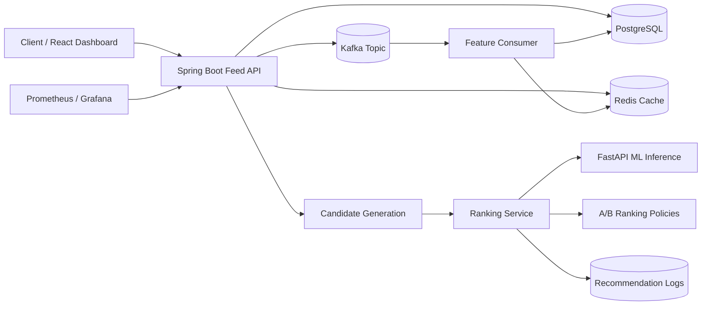

# Real-Time Ranking and Recommendation Platform

A production-style real-time personalization platform inspired by large-scale feed ranking, ads ranking, and recommendation systems. Users interact with content through events such as views, likes, skips, clicks, saves, shares, and watch time; the system ingests those events through Kafka, updates online features in PostgreSQL and Redis, generates candidates, calls an ML inference service, and serves an explainable personalized feed through Spring Boot APIs.

## Why This Project Matters

Modern consumer platforms depend on low-latency ranking systems that combine backend engineering, streaming data, feature computation, machine learning inference, caching, experimentation, observability, and offline evaluation. This project packages those concepts into a locally runnable reference platform for studying and experimenting with production-style feed ranking architecture.

## Architecture



## Tech Stack

- Backend: Java 17, Spring Boot 3, Spring Web, Spring Data JPA, Kafka, Redis, PostgreSQL, Maven
- ML: Python, FastAPI, pandas, scikit-learn, XGBoost, joblib
- Infrastructure: Docker, Docker Compose, Kafka, Zookeeper, Redis, PostgreSQL, Prometheus, Grafana
- Optional UI: React, TypeScript, Vite
- Load testing: k6

## Features

- Create users and content.
- Record `VIEW`, `LIKE`, `CLICK`, `SKIP`, `SAVE`, `SHARE`, and `WATCH_TIME` events.
- Persist events to PostgreSQL and publish them to Kafka.
- Consume Kafka events to update user preferences, engagement counters, popularity, freshness, and rate features.
- Cache user features, content features, and feeds in Redis.
- Generate candidates from recent, popular, and preference-matched content while excluding seen items.
- Rank candidates through FastAPI ML inference with deterministic fallback scoring when no model artifact exists.
- Assign users to deterministic ranking experiments: control, freshness boost, diversity boost, and exploration boost.
- Propagate model version and policy metadata through feed responses and recommendation logs.
- Expose feature freshness diagnostics and ML model metadata endpoints.
- Backtest ranking policies offline with `precision@10`, `NDCG@10`, and high-skip exposure metrics.
- Export Prometheus metrics and provision a Grafana dashboard for feed latency, cache hit ratio, and request volume.
- Return explainable metadata: predicted CTR, popularity, user-interest match, freshness, final score, and ranking reasons.
- Log recommendation request latency and per-item recommendation logs.

## System Design

The Spring Boot service acts as the local API gateway and recommendation backend. The event API writes durable events first, then publishes an interaction message to Kafka. The consumer updates online features and invalidates cached feeds. Feed requests generate up to 100 candidates, build ranking features, call the ML service, blend model output with business ranking signals, sort by final score, and store recommendation logs for analysis.

Baseline final score:

```text
final_score = 0.65 * predicted_ctr
            + 0.15 * freshness_score
            + 0.10 * popularity_score
            + 0.10 * category_match
```

Experiment policies can add freshness, exploration, or diversity adjustments on top of the baseline score.

## ML Design

The ML service exposes `POST /predict` and returns CTR-style probabilities plus confidence, model version, model stage, and fallback status. Training scripts generate 10,000 synthetic users, 5,000 content items, and 250,000 interaction rows. `training/train_ranker.py` trains an `XGBClassifier`, evaluates AUC, precision, recall, F1, and log loss, saves `models/ranking_model.joblib`, writes `models/metrics.json`, writes `models/model_metadata.json`, and emits a feature-importance plot.

If `ranking_model.joblib` is missing, the inference service uses a deterministic scoring function so the full stack remains runnable immediately after cloning.

## Run Locally

```bash
cp .env.example .env
docker compose up --build
```

Open:

- Backend API: `http://localhost:8080`
- Swagger UI: `http://localhost:8080/swagger-ui/index.html`
- ML service docs: `http://localhost:8000/docs`
- Actuator health: `http://localhost:8080/actuator/health`
- Prometheus metrics: `http://localhost:8080/actuator/prometheus`
- Prometheus: `http://localhost:9090`
- Grafana: `http://localhost:3000` with `admin` / `admin`

Seed data:

```bash
bash scripts/seed_data.sh
```

Run demo requests:

```bash
bash scripts/demo_requests.sh
```

Train the ranking model:

```bash
cd ml-service
python training/generate_synthetic_data.py
python training/train_ranker.py
python training/backtest_policies.py
```

Load test:

```bash
k6 run load-tests/k6-feed-ranking.js
```

## API Examples

Create a user:

```bash
curl -X POST http://localhost:8080/api/users \
  -H "Content-Type: application/json" \
  -d '{"username":"veda_ml","ageGroup":"18-24","country":"US"}'
```

Create content:

```bash
curl -X POST http://localhost:8080/api/content \
  -H "Content-Type: application/json" \
  -d '{"creatorId":1,"title":"How feed ranking systems work","category":"TECHNOLOGY","tags":["ml","ranking"],"durationSeconds":75,"language":"en","qualityScore":0.92}'
```

Record an event:

```bash
curl -X POST http://localhost:8080/api/events \
  -H "Content-Type: application/json" \
  -d '{"userId":1,"contentId":1,"interactionType":"LIKE","watchTimeSeconds":68,"deviceType":"web","sessionId":"demo-session"}'
```

Fetch a feed:

```bash
curl "http://localhost:8080/api/feed/1?limit=5"
```

Sample feed response:

```json
{
  "userId": 1,
  "generatedAt": "2026-05-11T22:49:00",
  "latencyMs": 34,
  "candidateCount": 100,
  "experimentName": "feed-ranking-v2",
  "experimentBucket": "freshness_boost",
  "rankingPolicy": "FRESHNESS_BOOST",
  "modelVersion": "ranking-xgb-20260512000000",
  "items": [
    {
      "contentId": 5,
      "title": "Building low-latency Redis caches",
      "category": "TECHNOLOGY",
      "predictedCtr": 0.7812,
      "contentPopularityScore": 0.41,
      "userInterestMatchScore": 1.0,
      "freshnessScore": 0.94,
      "explorationScore": 0.38,
      "diversityPenalty": 0.0,
      "finalScore": 0.7908,
      "rankPosition": 1,
      "rankingPolicy": "FRESHNESS_BOOST",
      "modelVersion": "ranking-xgb-20260512000000",
      "explanation": ["High match with user interests", "Fresh content boost", "Low skip probability"]
    }
  ]
}
```

## Evaluation Metrics

The training pipeline writes metrics to `ml-service/models/metrics.json`:

- AUC
- Precision
- Recall
- F1
- Log loss
- Train/test row counts
- Offline backtest metrics in `ml-service/models/backtest_report.json`

## Engineer-Focused Additions

- Ranking policy experiments with deterministic user bucketing.
- Recommendation logs that include model version, ranking policy, experiment bucket, feature snapshot, and latency.
- Model metadata endpoint and registry-style `model_metadata.json`.
- Feature store diagnostics endpoint for stale online features.
- Prometheus/Grafana observability and k6 load testing.
- Scaling and failure-mode documentation in `docs/scaling_plan.md`.

## Future Improvements

- Add approximate nearest-neighbor retrieval for embeddings.
- Add a true feature store abstraction and offline/online feature parity checks.
- Add rate limiting, authentication, and request tracing.
- Add streaming aggregations with Kafka Streams or Flink.
- Add integration tests with Testcontainers.

