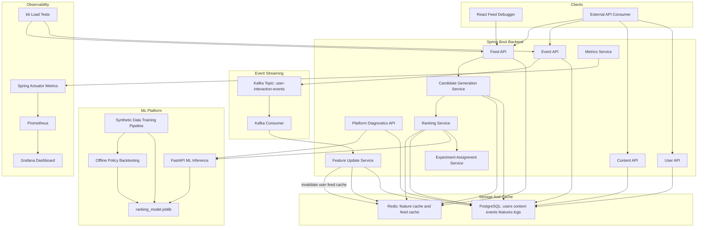
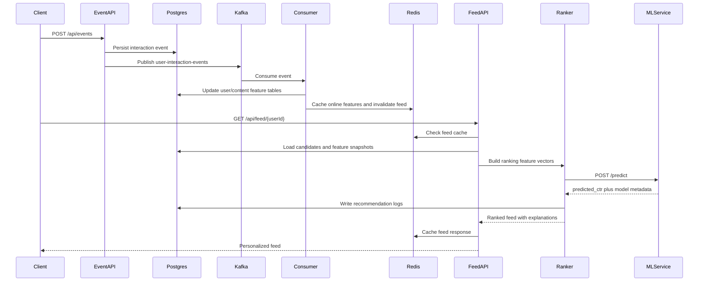

# RankStream

RankStream is a production-style real-time personalization platform inspired by large-scale feed ranking, ads ranking, and recommendation systems. Users interact with content through events such as views, likes, skips, clicks, saves, shares, and watch time. The platform ingests those events, updates online features, generates candidates, calls an ML inference service, applies ranking policies, logs recommendation decisions, and serves an explainable personalized feed through Spring Boot APIs.

## Why This Project Matters

Modern consumer platforms depend on low-latency ranking systems that combine backend engineering, streaming data, feature computation, machine learning inference, caching, experimentation, observability, and offline evaluation. This project packages those concepts into a locally runnable reference platform for studying and experimenting with production-style feed ranking architecture.

## Architecture



## End-To-End Flow



## Tech Stack

- Backend: Java 17, Spring Boot 3, Spring Web, Spring Data JPA, Kafka, Redis, PostgreSQL, Maven
- ML: Python, FastAPI, pandas, scikit-learn, XGBoost, joblib
- Infrastructure: Docker, Docker Compose, Kafka, Zookeeper, Redis, PostgreSQL, Prometheus, Grafana
- Optional UI: React, TypeScript, Vite
- Load testing: k6

## Repository Layout

```text
backend/            Spring Boot APIs, entities, repositories, services, Kafka, Redis, ML client
ml-service/         FastAPI inference app, synthetic data generation, training, evaluation
frontend/           Optional React TypeScript feed debugger
data/               Sample users, content, and interaction events
scripts/            Local seed and demo request scripts
docs/               Architecture, API, ML design, experiments, scaling, install docs
observability/      Prometheus config and Grafana provisioning/dashboard files
load-tests/         k6 workload for events and feed requests
```

## Features

- Create users and content.
- Record `VIEW`, `LIKE`, `CLICK`, `SKIP`, `SAVE`, `SHARE`, and `WATCH_TIME` events.
- Persist events to PostgreSQL and publish them to Kafka.
- Consume Kafka events to update user preferences, engagement counters, popularity, freshness, and rate features.
- Cache user features, content features, and feeds in Redis.
- Generate candidates from recent, popular, and preference-matched content while excluding seen items.
- Rank candidates through FastAPI ML inference with deterministic fallback scoring when no model artifact exists.
- Assign users to deterministic ranking experiments: control, freshness boost, diversity boost, and exploration boost.
- Propagate model version and policy metadata through feed responses and recommendation logs.
- Expose feature freshness diagnostics and ML model metadata endpoints.
- Backtest ranking policies offline with `precision@10`, `NDCG@10`, and high-skip exposure metrics.
- Export Prometheus metrics and provision a Grafana dashboard for feed latency, cache hit ratio, and request volume.
- Return explainable metadata: predicted CTR, popularity, user-interest match, freshness, final score, and ranking reasons.
- Log recommendation request latency and per-item recommendation logs.

## Service Responsibilities

| Component | Responsibility |
| --- | --- |
| `EventController` / `EventProducerService` | Accept user interaction events, persist them, and publish Kafka messages. |
| `EventConsumerService` | Consume Kafka events and trigger online feature updates. |
| `FeatureUpdateService` | Update user interests, engagement rates, content counters, freshness, popularity, Redis caches, and feed invalidation. |
| `CandidateGenerationService` | Retrieve recent, popular, and preference-matched content while excluding content the user already interacted with. |
| `RankingService` | Build feature vectors, call ML inference, apply experiment policies, compute final scores, explain results, and persist recommendation logs. |
| `MLInferenceClient` | Call FastAPI `/predict` and `/metadata`, with deterministic fallback if ML serving is unavailable. |
| `PlatformController` | Expose feature store health, model metadata, and active experiment definitions. |
| `MetricsService` | Emit feed latency, request counts, cache hit/miss, and inference latency metrics through Micrometer. |

## System Design

The Spring Boot service acts as the local API gateway and recommendation backend. The event API writes durable events first, then publishes an interaction message to Kafka. The consumer updates online features and invalidates cached feeds. Feed requests generate up to 100 candidates, build ranking features, call the ML service, blend model output with business ranking signals, sort by final score, and store recommendation logs for analysis.

Candidate sources:

- Recent content from the configured freshness window.
- Popular content sorted by content feature scores.
- Content from categories the user has positively engaged with.
- Fallback broad retrieval when there are not enough personalized candidates.

Ranking features:

- `user_total_interactions`
- `user_avg_watch_time`
- `user_like_rate`
- `user_skip_rate`
- `content_popularity_score`
- `content_freshness_score`
- `content_engagement_rate`
- `category_match`
- `creator_affinity`
- `content_age_hours`

Baseline final score:

```text
final_score = 0.65 * predicted_ctr
            + 0.15 * freshness_score
            + 0.10 * popularity_score
            + 0.10 * category_match
```

Experiment policies can add freshness, exploration, or diversity adjustments on top of the baseline score.

## Ranking Experiments

Users are deterministically assigned to `feed-ranking-v2` buckets:

- `CONTROL`: baseline formula.
- `FRESHNESS_BOOST`: gives recent content an extra boost.
- `DIVERSITY_BOOST`: penalizes repeated exposure to overrepresented categories.
- `EXPLORATION_BOOST`: boosts novel categories to learn new interests.

Every feed response and recommendation log includes:

- experiment name
- experiment bucket
- ranking policy
- model version
- feature snapshot
- request latency

## ML Design

The ML service exposes `POST /predict` and returns CTR-style probabilities plus confidence, model version, model stage, and fallback status. Training scripts generate 10,000 synthetic users, 5,000 content items, and 250,000 interaction rows. `training/train_ranker.py` trains an `XGBClassifier`, evaluates AUC, precision, recall, F1, and log loss, saves `models/ranking_model.joblib`, writes `models/metrics.json`, writes `models/model_metadata.json`, and emits a feature-importance plot.

If `ranking_model.joblib` is missing, the inference service uses a deterministic scoring function so the full stack remains runnable immediately after cloning.

Offline policy backtesting compares ranking policies with:

- `precision_at_10`
- `ndcg_at_10`
- `high_skip_exposure_rate`
- evaluated user count

## Platform Diagnostics

The backend exposes operational endpoints:

- `GET /api/platform/feature-store`: counts feature rows and stale online features.
- `GET /api/platform/model`: returns active ML model version, stage, fallback status, and load time.
- `GET /api/platform/experiments`: returns active ranking experiment definitions.

The ML service exposes:

- `GET /health`: service status and active model metadata.
- `GET /metadata`: model version, stage, fallback status, and load time.
- `POST /predict`: batch CTR predictions and model metadata.

## Run Locally

```bash
cp .env.example .env
docker compose up --build
```

If you have `make` installed, the same command is available as:

```bash
make up
```

Open:

- Backend API: `http://localhost:8080`
- React demo: `http://localhost:5173`
- Swagger UI: `http://localhost:8080/swagger-ui/index.html`
- ML service docs: `http://localhost:8000/docs`
- Actuator health: `http://localhost:8080/actuator/health`
- Prometheus metrics: `http://localhost:8080/actuator/prometheus`
- Prometheus: `http://localhost:9090`
- Grafana: `http://localhost:3000` with `admin` / `admin`

On Windows, install requirements are documented in `docs/install.md`.

## Demo Walkthrough

Use this flow when recording a portfolio video or walking an interviewer through the system:

1. Start Docker Compose and the Vite frontend.
2. Open `http://localhost:5173`.
3. Click `Reset demo data` to seed a clean technology/ML-focused storyline.
4. Click `Refresh feed` and point out candidate count, ranking policy, model version, latency, and final score.
5. Like or save the ML/backend items, then skip unrelated items.
6. Watch the learning-mode panel update category signals.
7. Refresh the feed and open the decision log panel to show persisted ranking decisions.
8. Open Swagger, Prometheus, or Grafana to show this is backed by APIs and observability, not a static UI.

Seed data:

```bash
bash scripts/seed_data.sh
```

Run demo requests:

```bash
bash scripts/demo_requests.sh
```

Run a smoke test against the local stack:

```bash
python scripts/smoke_test.py
```

Train the ranking model:

```bash
cd ml-service
python training/generate_synthetic_data.py
python training/train_ranker.py
python training/backtest_policies.py
```

Load test:

```bash
k6 run load-tests/k6-feed-ranking.js
```

## Observability

Prometheus scrapes the backend actuator endpoint. Grafana is provisioned with a dashboard that tracks:

- feed requests by ranking policy
- feed latency p95
- cache hit ratio

k6 can simulate event ingestion and feed reads to exercise Kafka, feature updates, ML inference, cache behavior, and ranking logs.

## API Examples

Create a user:

```bash
curl -X POST http://localhost:8080/api/users \
  -H "Content-Type: application/json" \
  -d '{"username":"veda_ml","ageGroup":"18-24","country":"US"}'
```

Create content:

```bash
curl -X POST http://localhost:8080/api/content \
  -H "Content-Type: application/json" \
  -d '{"creatorId":1,"title":"How feed ranking systems work","category":"TECHNOLOGY","tags":["ml","ranking"],"durationSeconds":75,"language":"en","qualityScore":0.92}'
```

Record an event:

```bash
curl -X POST http://localhost:8080/api/events \
  -H "Content-Type: application/json" \
  -d '{"userId":1,"contentId":1,"interactionType":"LIKE","watchTimeSeconds":68,"deviceType":"web","sessionId":"demo-session"}'
```

Fetch a feed:

```bash
curl "http://localhost:8080/api/feed/1?limit=5"
```

Sample feed response:

```json
{
  "userId": 1,
  "generatedAt": "2026-05-11T22:49:00",
  "latencyMs": 34,
  "candidateCount": 100,
  "experimentName": "feed-ranking-v2",
  "experimentBucket": "freshness_boost",
  "rankingPolicy": "FRESHNESS_BOOST",
  "modelVersion": "ranking-xgb-20260512000000",
  "items": [
    {
      "contentId": 5,
      "title": "Building low-latency Redis caches",
      "category": "TECHNOLOGY",
      "predictedCtr": 0.7812,
      "contentPopularityScore": 0.41,
      "userInterestMatchScore": 1.0,
      "freshnessScore": 0.94,
      "explorationScore": 0.38,
      "diversityPenalty": 0.0,
      "finalScore": 0.7908,
      "rankPosition": 1,
      "rankingPolicy": "FRESHNESS_BOOST",
      "modelVersion": "ranking-xgb-20260512000000",
      "explanation": ["High match with user interests", "Fresh content boost", "Low skip probability"]
    }
  ]
}
```

## Evaluation Metrics

The training pipeline writes metrics to `ml-service/models/metrics.json`:

- AUC
- Precision
- Recall
- F1
- Log loss
- Train/test row counts
- Offline backtest metrics in `ml-service/models/backtest_report.json`

## Engineer-Focused Additions

- Ranking policy experiments with deterministic user bucketing.
- Recommendation logs that include model version, ranking policy, experiment bucket, feature snapshot, and latency.
- Model metadata endpoint and registry-style `model_metadata.json`.
- Feature store diagnostics endpoint for stale online features.
- Prometheus/Grafana observability and k6 load testing.
- Scaling and failure-mode documentation in `docs/scaling_plan.md`.

## Documentation

- `docs/architecture.md`: service architecture and request flow.
- `docs/api.md`: API surface and response metadata.
- `docs/ml_design.md`: model features, training, serving, and backtesting.
- `docs/experiments.md`: ranking policy definitions and offline evaluation.
- `docs/system_design.md`: system goals, caching, reliability, and ranking path.
- `docs/scaling_plan.md`: how the local design maps to larger deployments.
- `docs/install.md`: local tool installation and development setup.

## Continuous Integration

GitHub Actions runs separate checks for:

- backend compilation with Java 17 and Maven
- Python ML service syntax validation
- React frontend production build
- Docker Compose configuration validation

## Future Improvements

- Add approximate nearest-neighbor retrieval for embeddings.
- Add a true feature store abstraction and offline/online feature parity checks.
- Add rate limiting, authentication, and request tracing.
- Add streaming aggregations with Kafka Streams or Flink.
- Add integration tests with Testcontainers.

